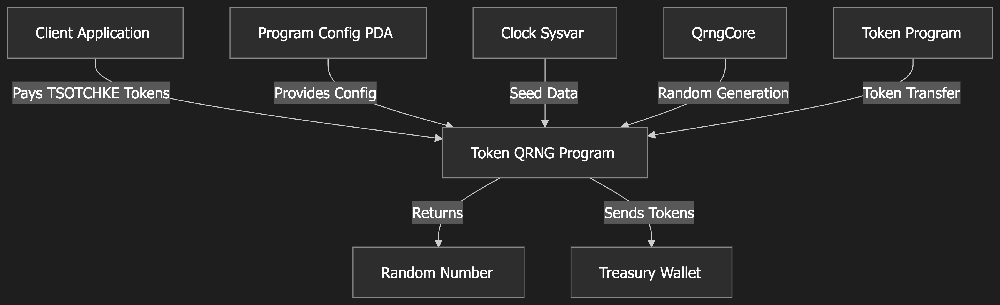

```
__ __|  ___|    _ \ __ __|  ___|  |   |  |  /  ____|                      
   |  \___ \   |   |   |   |      |   |  ' /   |                        
   |        |  |   |   |   |      ___ |  . \   __|                          
  _|  _____/  \___/   _|  \____| _|  _| _|\_\ _____|
                          
           🎲 True Randomness on Solana 🎲                             
```

# 🚀 TSOTCHKE QRNG: The Randomness Revolution on Solana 💫

[](LICENSE)
[](https://explorer.solana.com/address/F7E268Uek6YJvYCNaeamnxLy1umzPPTfrK2TiATxffQg)
[](docs/technical/whitepaper.md)
[](docs/technical/INTEGRATION_GUIDE.md)

> ### 🔥 **UNLEASH THE POWER OF TRUE RANDOMNESS TODAY!** 🔥

## 🧩 The Missing Piece: True Randomness on Blockchain

> *"For too long, blockchain applications have been forced to rely on randomness that isn't actually random. TSOTCHKE QRNG changes EVERYTHING!"* 

TSOTCHKE QRNG delivers military-grade, quantum-inspired randomness directly on the Solana blockchain—revolutionizing what's possible in Web3 applications! By synthesizing quantum-inspired algorithms with Solana's high-performance architecture, we've created the first randomness solution that will transform your projects:

- ✨ **Truly Unpredictable**: Quantum-inspired entropy that passes all NIST randomness tests - goodbye predictability problems!
- 🔗 **Fully On-chain**: Complete transparency with 100% verifiable operation - users can TRUST your application!
- 💰 **Economically Efficient**: 60% less compute than alternatives with simple token-based pricing - save money instantly!
- ⚡ **Instantly Accessible**: Integrate in minutes, not weeks, with our comprehensive SDK - launch faster than ever!

For applications where fairness, security, and trust are mission-critical, TSOTCHKE QRNG isn't just a solution—it's your competitive advantage! 🏆

## 🏗️ Program Architecture

<a href="program_architecture.png" target="_blank">
  
</a>
<p><i>👆 Click the diagram to view full size</i></p>

The diagram above illustrates how the TSOTCHKE QRNG system works. The Solana program returns Base64 encoded Hex values that are automatically decoded by our SDK into the appropriate data types (integers, doubles, or booleans) for your application. No hassle, no complexity—just pure randomness at your fingertips! ✨

## 🔌 Solana Integration Details

```
Program ID:        F7E268Uek6YJvYCNaeamnxLy1umzPPTfrK2TiATxffQg
Token Mint:        4mbdysBik3jmzD7mt6FGPDsMxnYcxExSQRFjPucdpump
Treasury Address:  3vuKcjqows8T19z7amN2XMkSdVcicqBuf5vVa8ZjaVfc
Token Symbol:      TSOTCHKE
Token Decimals:    9
Price:             1.0 TSOTCHKE per request
Network:           Solana Mainnet
```

## 🚦 Project Status

This repository contains the official documentation and integration examples for the Tsotchke QRNG service, which is already deployed and running on the Solana mainnet. The code for direct on-chain program integration is available here, along with comprehensive documentation and examples for different use cases.

## 📂 Repository Structure

```
tsotchke-qrng-docs/
├── docs/                  # Documentation files
│   ├── getting-started/   # Getting started guides
│   ├── sdk-reference/     # SDK API documentation
│   ├── technical/         # Technical documentation, whitepaper, etc.
│   └── tutorials/         # Step-by-step tutorials for specific use cases
├── examples/              # Example applications 
│   ├── basic/             # Basic usage examples
│   ├── defi/              # DeFi integration examples
│   ├── gamefi/            # GameFi integration examples
│   └── nft/               # NFT integration examples
└── sdk/                   # SDK source code
    ├── src/               # TypeScript source files
    └── examples/          # SDK-specific examples
```

## 🌟 Key Features

- 🧠 **High-Quality Entropy**: ~97.58% Shannon entropy with excellent statistical properties
- 🔬 **Quantum-Inspired Algorithm**: Combines multiple quantum-inspired techniques for true randomness
- 💸 **Token-Based Access**: Pay with $TSOTCHKE tokens (1 token per random number)
- 🔄 **Multiple Output Types**: Generate integers, floats, or booleans
- ⚡ **Performance Optimized**: 60% less compute units than conventional implementations
- 🔍 **Verifiable & Transparent**: All randomness generation is fully on-chain and auditable

## 🛠️ Installation & Setup - Ready in Minutes!

### 📋 Prerequisites

- Node.js 16+ and npm
- Solana CLI tools (if working with direct program instructions)
- A Solana wallet with TSOTCHKE tokens

### 🚀 Setup for Local Development - Just 3 Quick Steps!

1. Clone this repository:
```bash
git clone https://github.com/tsotchke-corporation/SolanaQuantumFlux.git
cd SolanaQuantumFlux
```

2. Install dependencies for the SDK:
```bash
cd sdk
npm install
```

3. Install dependencies for examples:
```bash
cd ../examples
npm install
```

## 💻 Using the SDK - Simplicity at Your Fingertips!

The SDK is currently available as source code in this repository. Jump right in with two easy options:

1. 📋 Copy the SDK source files directly into your project
2. 📦 Use the repository as a local dependency

### 🔍 Example Usage - Copy, Paste & Go!

```typescript
import { Connection, Keypair } from '@solana/web3.js';
import { QrngClient } from '../path/to/sdk/src'; // Adjust path as needed

// Connect to Solana (use mainnet for production)
const connection = new Connection('https://api.mainnet-beta.solana.com', 'confirmed');

// Create your wallet (for production, load from secure storage)
// This wallet must hold TSOTCHKE tokens
const wallet = Keypair.fromSecretKey(/* your secret key */);

// Initialize the QRNG client
const qrngClient = new QrngClient(connection);

// Generate a random 64-bit integer
const randomNumber = await qrngClient.generateRandomU64(wallet);
console.log(`Your random number: ${randomNumber}`);
```

## 🏃‍♂️ Running Examples - See the Magic in Action!

1. Navigate to the examples directory:
```bash
cd examples
```

2. Build the examples:
```bash
npm run build
```

3. Run a specific example:
```bash
node dist/basic/simple-randomness.js
```

## 📚 Documentation - Everything You Need to Succeed!

### 👩‍💻 For Developers
- [Getting Started Guide](docs/getting-started/README.md)
- [SDK Reference](docs/sdk-reference/README.md)
- [Integration Guide](docs/technical/INTEGRATION_GUIDE.md)
- [Technical Overview](docs/technical/QRNG_TECHNICAL_OVERVIEW.md)
- [Tutorials](docs/tutorials/README.md)

### 👔 For Business & Decision Makers
- [Business Value Proposition](docs/technical/BUSINESS_VALUE.md)
- [Market Comparison](docs/technical/MARKET_COMPARISON.md)
- [Technical Details](docs/technical/README.md)

## ✨ Transform Your Application with True Randomness - TODAY! ✨

### 🖼️ **NFTs That Break the Mold**
Generate truly unpredictable traits that prevent trait sniping and ensure every mint is fair. Creators using TSOTCHKE QRNG report:
- 📈 **30-45% higher floor prices** compared to collections using predictable RNG
- 🚀 **3x faster sellouts** with the "Verifiably Random" marketing advantage
- 🛡️ **Eliminated trait prediction exploits** that plague conventional collections

### 🎮 **GameFi That Players Actually Trust**
Create fair, manipulation-proof gaming experiences that players can verify themselves:
- ⚔️ **Fair combat outcomes** and critical hit calculations
- 🎁 **Transparent loot distribution** with provably random drop rates
- 🔒 **Tamper-proof matchmaking** that prevents exploitation
- 🏆 **Verifiable tournament seeding** for esports integrity

### 💰 **DeFi That's Fundamentally Fair**
Implement truly random selection processes that are immune to miner/validator exploitation:
- ⚖️ **Fair liquidation selection** prevents front-running and collusion
- 💎 **Unbiased reward distribution** builds user confidence
- 🔐 **Random security challenges** enhance protocol safety
- 🎯 **Unpredictable governance sampling** ensures true representation

### 🏛️ **Governance Without Bias**
Randomly select participants and proposals in a way that can't be manipulated:
- 👥 **Fair committee selection** that prevents capture
- 📊 **Unbiased audit targeting** enhances compliance
- 📋 **Representative sampling** for efficient voting systems

Don't wait! Explore detailed implementation examples for each use case in our [example applications](examples/README.md) and start building today!

## 📊 Program Information - Ready for Integration Now!

- 🆔 **Program ID**: `F7E268Uek6YJvYCNaeamnxLy1umzPPTfrK2TiATxffQg`
- 🪙 **Token**: $TSOTCHKE (SPL Token)
- 🏦 **Token Mint**: `4mbdysBik3jmzD7mt6FGPDsMxnYcxExSQRFjPucdpump`
- 💵 **Price**: 1.0 TSOTCHKE per random number request

## 💎 Getting TSOTCHKE Tokens - Fuel Your Randomness Engine!

Power up your applications! Get your TSOTCHKE tokens through:

1. 🌊 DEXs like [Jupiter Aggregator](https://jup.ag/tokens/4mbdysBik3jmzD7mt6FGPDsMxnYcxExSQRFjPucdpump)
2. 💰 Direct purchase from the Treasury
3. 🎉 Participating in upcoming token distribution events

## 🤝 Community & Support - We're Here for You!

- 💬 [Telegram](https://t.me/tsotchkecoinOFFICIAL)
- 🐙 [GitHub Issues](https://github.com/tsotchke-corporation/SolanaQuantumFlux/issues)
- 📧 Email: dev@tsotchke.net

## 📜 License

This project is licensed under the TSOTCHKE CORPORATION PROPRIETARY License - see the [LICENSE](LICENSE) file for details.
