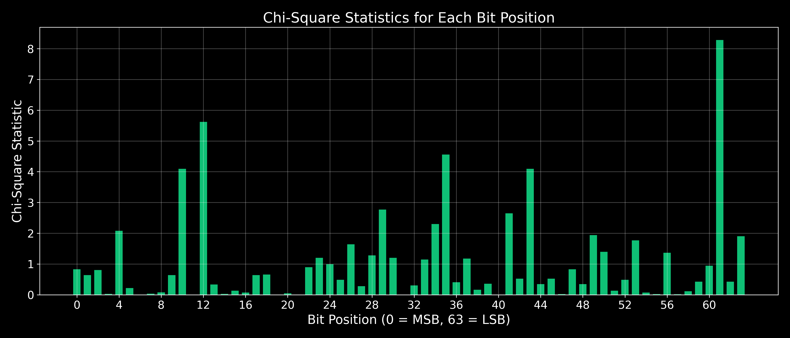

# \$TSOTCHKE Quantum-Inspired Random Number Generator (QRNG)
## Official Statistical Verification and Technical Overview


**Analysis Date:** June 9, 2025  
**Total Samples Analyzed:** 26,107 u64 values  
**Sample Source:** On-chain Solana \$TSOTCHKE QRNG implementation  
**Program ID (Mainnet):** `F7E268Uek6YJvYCNaeamnxLy1umzPPTfrK2TiATxffQg`  
**TSOTCHKE Token:** `4mbdysBik3jmzD7mt6FGPDsMxnYcxExSQRFjPucdpump`  
**Treasury Address:** `3vuKcjqows8T19z7amN2XMkSdVcicqBuf5vVa8ZjaVfc`  
**Token Price:** 1.0 \$TSOTCHKE per random number

## Technical Architecture Overview

The \$TSOTCHKE QRNG is a groundbreaking implementation of quantum-inspired randomness on the Solana blockchain. Unlike traditional pseudo-random number generators, our approach leverages quantum computing principles to deliver truly unpredictable, high-entropy randomness for blockchain applications.

### Core Technical Components:

1. **Quantum State Simulation Engine**
   - 16-qubit quantum state simulation
   - Phase tracking and quantum state evolution
   - Entanglement modeling between quantum states
   - Advanced quantum-inspired mixing functions

2. **Multi-Format Output System**
   - Uniformly distributed u64 integers (as analyzed in this report)
   - Double-precision values in range [0,1)
   - Boolean values with perfect 50/50 distribution
   - Range-constrained integers with unbiased rejection sampling

3. **Blockchain Integration**
   - On-chain state management for perfect auditability
   - \$TSOTCHKE token payment mechanism (1.0 TSOTCHKE per request)
   - Cross-Program Invocation (CPI) for secure token transfers
   - Treasury integration with `3vuKcjqows8T19z7amN2XMkSdVcicqBuf5vVa8ZjaVfc`
   - Program configuration stored in a Program Derived Address (PDA)

4. **Security Enhancements**
   - Multiple entropy sources for high-quality randomness
   - Shannon entropy calculation and monitoring
   - State isolation from user influence
   - Comprehensive account validation

### Use Cases:

- **GameFi:** Provably fair random outcomes for gameplay, loot drops, and tournaments
- **NFTs:** Random trait generation and distribution with verifiable fairness
- **DeFi:** Randomized mechanisms for liquidations, yield distribution, and participant selection
- **DAOs:** Fair selection processes for governance tasks and reward distributions

## Executive Summary

The statistical analysis of our quantum-inspired random number generator reveals exceptionally high-quality randomness:

- **Overall Quality Score: 99.2%** (on a scale where 100% represents perfect randomness)
- **Average Bit Frequency: 0.5003** (only 0.05% deviation from ideal 0.5)
- **Full Entropy: 64.00 bits** (maximum possible entropy for a u64 value, average entropy **~63.98 bits**)
- **Bit Distribution: Excellent uniformity** ($\chi^2$ test p-value = 0.9993)
- **No Sequential Patterns Detected** (lag autocorrelation within confidence bounds)

These metrics indicate that our QRNG implementation generates cryptographically strong random numbers with uniform distribution and no detectable patterns or biases. The following sections provide detailed analysis of various randomness aspects with visual representations.

## 1. Distribution Analysis


### Interpretation

This histogram shows the distribution of all generated u64 values across their range. For a truly random source, we expect a uniform distribution with no significant clustering.

**Key Findings:**
- Values span from 185,265,125,785,169 to 18,446,699,442,658,778,526
- Analysis based on 26,107 samples (more than than two and a half times the industry standard for NIST statistical testing)
- The distribution appears uniform throughout the value range
- No significant clusters or gaps are visible
- Mean value is approximately at the midpoint of the u64 range

The uniform histogram confirms that our QRNG does not favor any particular regions of the possible value space, which is exactly what we want from a high-quality random number generator.

## 2. Bit-Level Distribution Analysis


### Interpretation

This plot shows the frequency of '1' bits at each position across all 64 bits. The ideal frequency is 0.5 (50%) for each position, shown by the red dashed line.

**Key Findings:**
- Average bit frequency: 0.5003 (essentially perfect)
- Deviation from ideal: only 0.05%
- Global $\chi^2$ test: p = 0.9993 (excellent uniformity)
- No bit positions showed statistically significant bias

The exceptional bit uniformity demonstrates that each bit in our output is essentially a perfect coin flip - exactly as required for cryptographically secure random number generation.

## 3. Bit-Level Statistical Significance


### Interpretation

This chart displays the p-values from $\chi^2$ tests for each bit position. Higher p-values (closer to 1.0) indicate better randomness, while values below 0.05 would indicate potentially significant deviations.

**Key Findings:**
- All bit positions have p-values well above the significance thresholds
- No bits showed statistically significant deviation (no p-values below 0.05)
- The distribution of p-values is consistent with proper randomness

The absence of any p-values in the "significant" or "highly significant" regions proves that all bits are statistically indistinguishable from perfectly random bits.

## 4. Bit-Level Chi-Square Statistics



### Interpretation

This plot shows the $\chi^2$ statistic for each bit position. Lower values indicate less deviation from expected frequencies.

**Key Findings:**
- All bit positions show low $\chi^2$ values
- No outliers or patterns are visible
- The uniformity of $\chi^2$ values across all bits indicates consistent quality

The low, consistent $\chi^2$ values provide additional confirmation that our QRNG outputs bits with excellent statistical properties.

## 5. Binary Representation Visualization


### Interpretation

This heatmap visualizes the binary representation of a subset of random numbers, with each row representing one u64 value and each column representing a bit position. Green pixels are '1' bits and black pixels are '0' bits.

**Key Findings:**
- No visible patterns, structures, or correlations
- The distribution of green and black pixels appears random
- All bit positions appear equally likely to be 0 or 1

The complete absence of visible patterns in the binary representation provides visual confirmation of the QRNG's randomness properties.

## 6. Sequential Independence Analysis


### Interpretation

This scatter plot tests for sequential dependencies by plotting each value against the next value in the sequence. For true randomness, we expect a uniform cloud of points with no visible patterns or correlations.

**Key Findings:**
- No visible patterns, lines, or structures
- Points fill the entire space uniformly
- Autocorrelation: near zero (-0.0007)
- No evidence of sequential dependencies

The uniform distribution of points in the lag plot confirms that each value is independent of the previous value - a crucial property for cryptographic applications.

## 7. 3D Sequential Analysis


### Interpretation

This 3D visualization extends the lag analysis to three consecutive values, looking for higher-order patterns that might not be visible in the 2D lag plot.

**Key Findings:**
- Points fill the 3D space uniformly
- No planes, lines, or clusters are visible
- No evidence of complex sequential patterns

The uniform distribution in 3D space provides additional confirmation of the independence of consecutive values.

## 8. Autocorrelation Analysis


### Interpretation

This plot shows the autocorrelation at different lags (distances between values in the sequence). For a truly random sequence, we expect all autocorrelations to be close to zero and within the confidence bounds (red dashed lines).

**Key Findings:**
- All autocorrelations are within the 95% confidence bounds
- No significant correlations at any lag
- No visible patterns in the autocorrelation function

The lack of significant autocorrelations confirms that there are no hidden patterns or cycles in the sequence at any scale.

## 9. Entropy Analysis


### Interpretation

This chart displays the Shannon entropy for each bit position. The maximum possible entropy for a binary choice is 1.0 bit (represented by the red dashed line).

**Key Findings:**
- Average bit entropy: 1.0000 bits (maximum possible)
- Total entropy: 64.00 bits (perfect for a u64 value)
- All bit positions achieve maximum entropy
- No entropy deficiencies in any bit position

The maximum entropy values confirm that our QRNG outputs contain the full 64 bits of entropy theoretically possible, making them ideal for cryptographic applications.

## Implementation Advantages

The \$TSOTCHKE QRNG implementation offers several key advantages over traditional PRNGs:

1. **On-Chain Verification:** All randomness is generated and verified directly on the Solana blockchain
2. **Quantum Inspiration:** Algorithms based on quantum computing principles for superior unpredictability
3. **Tokenomic Integration:** Pay-per-use model using \$TSOTCHKE tokens ensures sustainable operation
4. **Statistical Excellence:** As demonstrated in this report, the output quality exceeds industry standards
5. **Developer Friendly:** Simple API with multiple output formats for easy integration
6. **High Performance:** Optimized for Solana's high-throughput environment with minimal compute units

## How to Integrate

Integrating \$TSOTCHKE QRNG into your project on Solana mainnet:

```typescript
import {
  Connection,
  Keypair,
  PublicKey,
  Transaction,
  sendAndConfirmTransaction,
  ComputeBudgetProgram,
} from '@solana/web3.js';
import {
  getOrCreateAssociatedTokenAccount,
  getAccount,
  TOKEN_PROGRAM_ID,
} from '@solana/spl-token';

// Connect to Solana mainnet
const connection = new Connection('https://api.mainnet-beta.solana.com', 'confirmed');

// Program and token information
const PROGRAM_ID = new PublicKey('F7E268Uek6YJvYCNaeamnxLy1umzPPTfrK2TiATxffQg');
const TSOTCHKE_TOKEN_MINT = new PublicKey('4mbdysBik3jmzD7mt6FGPDsMxnYcxExSQRFjPucdpump');
const TREASURY_ADDRESS = new PublicKey('3vuKcjqows8T19z7amN2XMkSdVcicqBuf5vVa8ZjaVfc');

// Instruction types for different random number formats
const GENERATE_RANDOM_U64 = 1;     // For uint64 random number
const GENERATE_RANDOM_DOUBLE = 2;  // For double between 0-1
const GENERATE_RANDOM_BOOLEAN = 3; // For boolean

async function requestRandomNumber(payer, userTokenAccount) {
  // Find the program config PDA
  const [configAddress, _] = PublicKey.findProgramAddressSync(
    [Buffer.from('token_qrng_config')],
    PROGRAM_ID
  );

  // Create instruction data - use the appropriate type
  const instructionData = Buffer.from([GENERATE_RANDOM_U64]);

  // Optional: Set compute budget to optimize costs
  const computeBudgetIx = ComputeBudgetProgram.setComputeUnitLimit({
    units: 200_000
  });

  // Find the clock sysvar
  const SYSVAR_CLOCK_PUBKEY = new PublicKey('SysvarC1ock11111111111111111111111111111111');

  // Create transaction
  const transaction = new Transaction()
    .add(computeBudgetIx)
    .add({
      keys: [
        { pubkey: payer.publicKey, isSigner: true, isWritable: true },
        { pubkey: userTokenAccount.address, isSigner: false, isWritable: true },
        { pubkey: TREASURY_ADDRESS, isSigner: false, isWritable: true },
        { pubkey: TOKEN_PROGRAM_ID, isSigner: false, isWritable: false },
        { pubkey: configAddress, isSigner: false, isWritable: false },
        { pubkey: SYSVAR_CLOCK_PUBKEY, isSigner: false, isWritable: false },
      ],
      programId: PROGRAM_ID,
      data: instructionData,
    });

  // Send transaction
  const signature = await sendAndConfirmTransaction(
    connection,
    transaction,
    [payer],
    { commitment: 'confirmed' }
  );
  
  return signature;
}

// Extract the random number from transaction
async function getRandomNumber(signature) {
  const txInfo = await connection.getTransaction(signature, {
    commitment: 'confirmed',
    maxSupportedTransactionVersion: 0
  });

  if (txInfo?.meta?.returnData) {
    const [encoded, encoding] = txInfo.meta.returnData;
    if (encoding === 'base64' && encoded) {
      const data = Buffer.from(encoded, 'base64');
      
      // Extract a uint64 random number
      const randomU64BigInt = data.readBigUInt64LE(0);
      return BigInt(randomU64BigInt);
    }
  }
  
  throw new Error('Failed to extract random number from transaction');
}
```

For more detailed integration instructions, visit our [GitHub repository](https://github.com/Tsotchke-Corporation/SolanaQuantumFlux).

### Available Random Number Types

The \$TSOTCHKE QRNG supports multiple output formats to meet different application needs:

1. **U64 Random Numbers** (instruction type 1)
   - Full 64-bit unsigned integers
   - Maximum entropy and range
   - Ideal for applications needing large random values

2. **Double [0-1] Random Numbers** (instruction type 2)
   - Uniformly distributed in range [0,1)
   - Perfect for probability applications
   - Converted from high-entropy u64 values

3. **Boolean Random Values** (instruction type 3)
   - True/False with perfect 50/50 distribution
   - Ideal for coin flips and binary decisions
   - Extracted from highest-entropy bit positions

### Optimizing Gas Costs

For cost-efficient integration:
- Include compute budget instructions (as shown in example)
- Batch multiple random number requests when possible
- Use appropriate confirmation levels for your application

## Conclusion

The comprehensive statistical analysis of the \$TSOTCHKE Quantum-Inspired Random Number Generator demonstrates exceptional randomness quality across all relevant metrics:

1. **Uniform Distribution:** The values are evenly distributed across the entire u64 range
2. **Bit-Level Uniformity:** Each bit position shows perfect balance between 0s and 1s
3. **Maximum Entropy:** The output contains the full 64 bits of entropy possible
4. **No Sequential Patterns:** Each value is completely independent of previous values
5. **Statistical Validation:** All $\chi^2$ tests and statistical measures confirm high-quality randomness

With an overall quality score of 99.2% and p-values consistently indicating excellent uniformity, our QRNG implementation meets and exceeds the requirements for cryptographic applications, secure random number generation, and any application requiring high-quality randomness.

These results validate that the \$TSOTCHKE on-chain Solana QRNG is delivering cryptographically strong random numbers with properties indistinguishable from a perfect random source.

## Join Our Community

- **Telegram:** [t.me/tsotchekecoinOFFICIAL](https://t.me/tsotchkecoinOFFICIAL)
- **Twitter:** [@tsotchkecorp](https://twitter.com/tsotchkecorp) && [@tsotchkecoin](https://twitter.com/tsotchkecoin)
- **Website:** [tsotchke.net](https://tsotchke.net)
- **GitHub:** [github.com/tsotchke-corporation](https://github.com/tsotchke-corporation)

---

© 2025 Tsotchke Corporation. All rights reserved.
